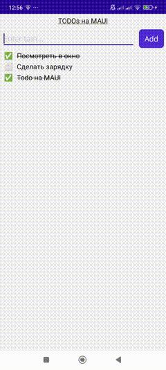

# todoMAUI

Android

<!--  -->

### Используемые технологии:
- Visual Studio Community
- MVVM
- Binding
- XAML
- Sqlite для храненя данных

## Полезные команды

- ffmpeg -i animateAndroid.mp4 -vf "fps=8,scale=240:-1" -gifflags +transdiff -y animateAndroid.gif - конвертация в gif

## Полезные команды для VS

- Ctrl + Alt + Page Down - следующая вкладка
- Ctrl + Alt + Page Up - предыдущая вкладка
- Ctrl + K, потом Ctrl + D  Форматирование
- Ctrl + Shift + L Удаление строки
- Ctrl + - (минус) - назад в истории навигации
- Ctrl + Shift + - - вперед в истории навигации

## Что запомнилось:

- Как далеко шагнул C# от Xamarin'-а до своего MAUI и сторонних фреймворков AvaloniaUI, Uno Platform 🏆 🙌
- Интересный пример из "коробки" с sqlite 👍
- Синтаксис xaml и code-behind 🥸
- Привязка Binding 🤪